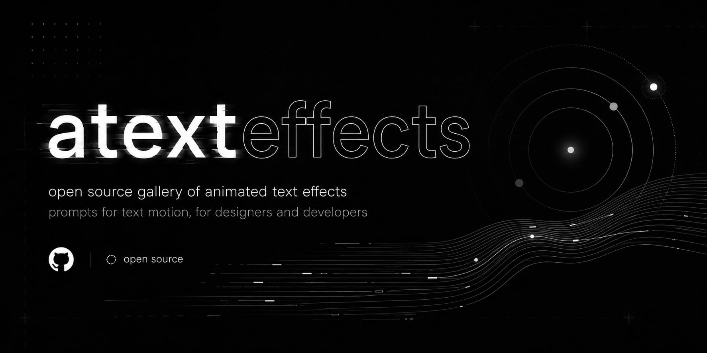
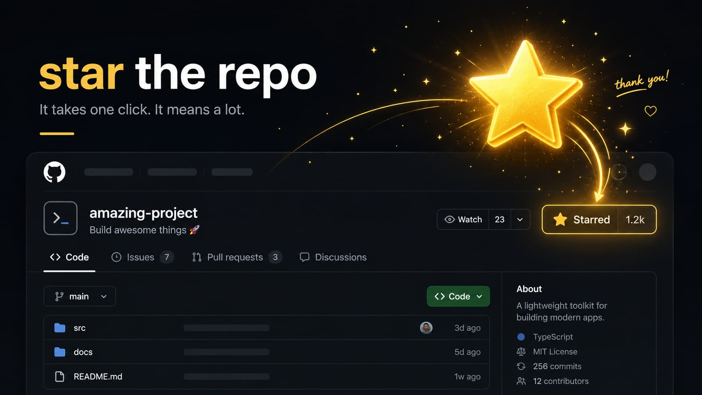

<p align="center">
  
</p>

<p align="center">
  <strong>A curated collection of animated text effects with agnostic prompts for any modern web stack or AI assistant.</strong>
  Website: <a href="https://atexteffects.vercel.app">atexteffects.vercel.app</a>
</p>

<p align="center">
  <a href="https://github.com/YamilAyma/atexteffects"></a>
  <a href="https://github.com/YamilAyma/atexteffects/stargazers"></a>
  <a href="https://github.com/YamilAyma/atexteffects/blob/main/LICENSE"></a>
</p>

---

## Features

- **110 Ready-to-use Effects**: Spanning across kinetic, glitch, reveal, ambient, distortion, and interactive typography.
- **Agnostic AI Prompts**: One-click copyable prompts crafted for Claude, ChatGPT, v0, Cursor, or Gemini.
- **Comparison Lab**: Side-by-side synchronized preview of up to 3 effects with real-time text input.
- **Focus Mode**: Press and hold any card to isolate and inspect its animation frame-by-frame.
- **Live Custom Text**: Type any word or phrase into the global bar to preview across the entire library.
- **Spring Layout Shuffle**: Reorganize effects with fluid physics transitions.

---

## Quick Start

### Prerequisites

- [Node.js](https://nodejs.org/) (v18+)
- [pnpm](https://pnpm.io/) (v9+)

### Installation & Setup

```bash
# Clone the repository
git clone https://github.com/YamilAyma/atexteffects.git

# Navigate into project directory
cd atexteffects

# Install dependencies
pnpm install

# Start development server
pnpm dev
```

Visit `http://localhost:3000` in your browser.

---

## Project Structure & Extending

```
src/
├── animations/
│   └── renderer.tsx          # Real-time procedural animation renderer
├── components/
│   ├── CompareModal.tsx      # Side-by-side comparison laboratory
│   ├── EffectCard.tsx        # Responsive preview card with focus & compare
│   ├── EffectModal.tsx       # Detail view & agnostic prompt exporter
│   ├── Header.tsx            # Search, live custom text, and view toggles
│   └── Sidebar.tsx           # Category navigation and counts
├── data/
│   ├── categories.ts         # Catalog taxonomy
│   └── effects/              # Categorized effect prompt definitions
├── hooks/                    # Hash routing, intersection observer, reduced motion
└── types.ts                  # Core TypeScript types
```

### Adding a New Effect

1. Define your effect metadata and prompt inside `src/data/effects/<category>.ts`:
```ts
{
  id: 'my-new-effect',
  name: 'My New Effect',
  categoryId: 'kinetic',
  description: 'Smooth floating typographic effect.',
  tags: ['float', 'smooth', 'hover'],
  prompt: 'Create a smooth text animation where...',
  durationMs: 2000,
  loop: true,
  animType: 'transform',
  sampleText: 'motion'
}
```
2. Implement its visual logic in the `renderVisual()` switch case in `src/animations/renderer.tsx`.

---

## Contributing

Contributions of new text effects, prompt optimizations, or UX enhancements are warmly welcomed.

1. **Fork** the repository.
2. **Create a branch**: `git checkout -b feature/new-text-effect`.
3. **Commit your changes**: `git commit -m "feat (Effects) - Add wave-pulse text effect"`.
4. **Push to branch**: `git push origin feature/new-text-effect`.
5. **Open a Pull Request**.

---

<p align="center">
  <a href="https://github.com/YamilAyma/atexteffects/stargazers">
    
  </a>
</p>

<p align="center">
  <em>If you find <strong>atexteffects</strong> inspiring or useful for your projects, consider giving it a star on GitHub.</em>
</p>
